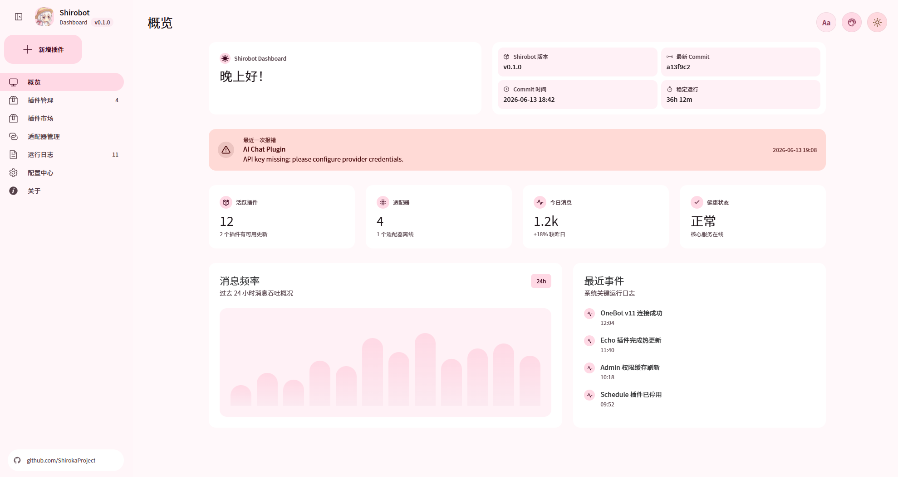

<div align="center">

<a href="https://github.com/ShirokaProject">
  
</a>

<p><strong><span style="font-size: 2.2em;">Shirobot Dashboard</span></strong></p>

<p><em>一个面向 Shirobot 的轻量 Material Design 3 风格 Web 控制台。</em></p>

</div>

## 简介

Shirobot Dashboard 是 Shirobot 生态的前端管理界面。

<p align="center">
  
</p>

## 功能

- 概览页：查看 Shirobot 版本、提交信息、健康状态、最近错误和运行概况。
- 插件管理：查看已安装插件、按状态筛选、启停插件、打开插件配置。
- 插件上传：选择本地 `.dll` 插件文件并提交给后端解析。
- 插件市场：按来源、分类和排序方式浏览可安装插件。
- 插件配置：管理插件基础设置、权限、触发器和高级选项。
- 适配器管理：查看连接状态和事件数量。
- 运行日志：查看运行时日志、消息事件、插件输出和错误详情。
- 配置中心：管理基础配置、管理员和消息策略。
- 关于页面：展示项目入口、资源说明和版本信息。

## 技术栈

- Vue 3
- Vite
- TypeScript
- Vue Router
- Element Plus
- Tailwind CSS

## 项目结构

```text
src/
├─ api/                 # 后端 API 请求入口
├─ assets/              # 静态资源与本地字体
├─ features/            # 业务类型与工具函数
├─ layout/              # 应用布局、导航和顶部控制区
├─ router/              # 路由与页面预加载
├─ theme/               # 主题色与明暗模式逻辑
├─ views/               # 页面模块
│  ├─ about/
│  ├─ adapters/
│  ├─ config/
│  ├─ logs/
│  ├─ overview/
│  ├─ plugin/
│  ├─ pluginConfig/
│  └─ pluginMarket/
└─ style.css            # 全局 MD3 tokens、字体和基础样式
```

## 开发

安装依赖：

```bash
npm install
```

启动开发服务器：

```bash
npm run dev
```

如需局域网访问：

```bash
npm run dev -- --host 0.0.0.0
```

构建：

```bash
npm run build
```

预览构建产物：

```bash
npm run preview
```

## API 约定

所有前端请求入口统一放在：

```text
src/api
```

当前前端不内置 mock 数据。后端尚未接入时，页面会展示空状态和接口待接入提示。

已预留的接口示例：

- `GET /api/dashboard/overview`：概览数据
- `GET /api/plugins`：已安装插件列表
- `PUT /api/plugins/:pluginId/state`：启停插件
- `POST /v1/plugins/upload`：上传插件包（文件类型、大小与安全校验由后端实现）
- `GET /api/plugins/:pluginId/config`：插件配置
- `PUT /api/plugins/:pluginId/config`：保存插件配置
- `GET /api/adapters`：适配器列表
- `GET /api/runtime/logs`：运行日志
- `GET /api/plugin-market/plugins`：插件市场
- `GET /api/config`：应用配置
- `PUT /api/config`：保存应用配置

## 许可证

本项目使用 GNU General Public License v3.0。
详见 [LICENSE](./LICENSE)。
