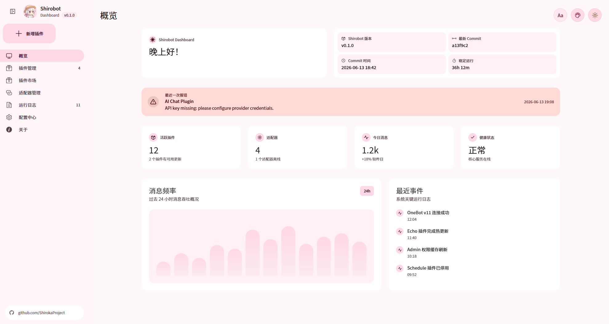

<div align="center">

<a href="https://github.com/ShirokaProject">
  
</a>

<p><strong><span style="font-size: 2.2em;">Shirobot Dashboard</span></strong></p>

<p><em>一个面向 Shirobot 的轻量 Material Design 3 风格 Web 控制台。</em></p>

</div>

## 简介

Shirobot Dashboard 是 Shirobot 生态的前端管理界面。

<p align="center">
  
</p>

## 功能

- 概览页：查看 Shirobot 版本、提交信息、健康状态、最近错误和运行概况。
- 插件管理：查看已安装插件、按状态筛选、启停插件、打开插件配置，并执行后端声明的插件操作。
- 插件上传：选择本地 `.dll` 插件文件并提交给后端解析。
- 插件市场：搜索和分类浏览真实目录，查看健康、版本、下载量和安装状态，并通过 GitHub release 预览确认安装。
- 插件配置：管理插件基础设置、权限、触发器和高级选项。
- 适配器管理：查看连接状态和事件数量。
- 运行日志：查看运行时日志、消息事件、插件输出和错误详情。
- 配置中心：管理基础配置、管理员和消息策略。
- 关于页面：展示项目入口、资源说明和版本信息。

## 技术栈

- Vue 3
- Vite
- TypeScript
- Vue Router
- Element Plus
- Tailwind CSS

## 项目结构

```text
src/
├─ api/                 # 后端 API 请求入口
├─ assets/              # 静态资源与本地字体
├─ features/            # 业务类型与工具函数
├─ layout/              # 应用布局、导航和顶部控制区
├─ router/              # 路由与页面预加载
├─ theme/               # 主题色与明暗模式逻辑
├─ views/               # 页面模块
│  ├─ about/
│  ├─ adapters/
│  ├─ config/
│  ├─ logs/
│  ├─ overview/
│  ├─ plugin/
│  ├─ pluginConfig/
│  └─ pluginMarket/
└─ style.css            # 全局 MD3 tokens、字体和基础样式
```

## 开发

安装依赖：

```bash
npm ci
```

启动开发服务器：

```bash
npm run dev
```

如需局域网访问：

```bash
npm run dev -- --host 0.0.0.0
```

构建：

```bash
npm run build
```

预览构建产物：

```bash
npm run preview
```

## API 约定

所有前端请求入口统一放在：

```text
src/api
```

API 模式使用以下 `/api/v1` 接口；演示模式也遵循相同响应结构。

### 插件市场

- `GET /api/v1/plugin-market/plugins`

响应为目录对象：

```json
{
  "schemaVersion": "1.0",
  "generatedAt": "2026-07-14T08:00:00Z",
  "plugins": [
    {
      "id": "weather",
      "kind": "plugin",
      "name": "Weather",
      "description": "天气查询插件",
      "category": "工具",
      "authors": [{ "name": "Mika", "url": "https://github.com/mika" }],
      "repository": "owner/repository",
      "license": "MIT",
      "compatibility": "Shirobot >= 0.1.0",
      "deprecated": false,
      "release": {
        "version": "2.3.0",
        "prerelease": false,
        "publishedAt": "2026-05-28T10:00:00Z",
        "pageUrl": "https://github.com/owner/repository/releases/tag/v2.3.0",
        "downloadCount": 18000,
        "asset": { "name": "plugin.zip", "url": "https://github.com/...", "size": 245760 }
      },
      "health": { "status": "healthy", "message": "校验通过" },
      "installed": { "version": "2.2.0", "enabled": true }
    }
  ]
}
```

前端不会请求或跳转目录中的 `pageUrl`、`asset.url`、作者 URL。安装只把 `repository` 交给当前 Shirobot 后端：

1. `POST /api/v1/plugins/install/github`，body 为 `{ "repository": "owner/repository", "includePrerelease": false }`，返回与上传插件相同的解析预览。
2. 用户确认预览后，`POST /api/v1/plugins/upload/{uploadId}/confirm`，body 为 `{ "replace": false, "enable": true }`。
3. 用户取消预览时，`DELETE /api/v1/plugins/upload/{uploadId}`。

### 插件操作

- `GET /api/v1/plugins/list`：已安装插件列表。
- `POST /api/v1/plugins/{id}/enable`、`POST /api/v1/plugins/{id}/disable`：切换插件状态。
- `GET /api/v1/plugins/{id}/actions`：返回 `{ "actions": [{ "id", "label", "description", "tone", "requires_confirmation", "confirmation_text" }] }`。
- `POST /api/v1/plugins/{id}/actions/{actionId}`：返回 `{ "ok": true, "message": "...", "refresh": true }`；`refresh` 为 `true` 时前端重新加载插件列表和操作项。
- `POST /api/v1/plugins/upload`：上传本地 `.dll` 或 `.zip` 并返回解析预览。

### 插件配置

- `GET /api/v1/plugins/{id}/config`：返回 `plugin_id`、`config`、`schema` 和 `routes`。
- `PATCH /api/v1/plugins/{id}/config`：`config`、`routes` 均可按需提交。成功响应中的 `schema` 可省略；前端会保留已加载 schema，也接受仅返回更新字段或 `204 No Content`。

### 其他页面

- `GET /api/v1/overview`
- `GET /api/v1/adapters`
- `GET /api/v1/runtime/logs`
- `GET /api/v1/logs/sources`
- `GET /api/v1/logs/stream`（WebSocket）
- `GET /api/v1/config`
- `PATCH /api/v1/config`

## 许可证

本项目使用 GNU General Public License v3.0。
详见 [LICENSE](./LICENSE)。
