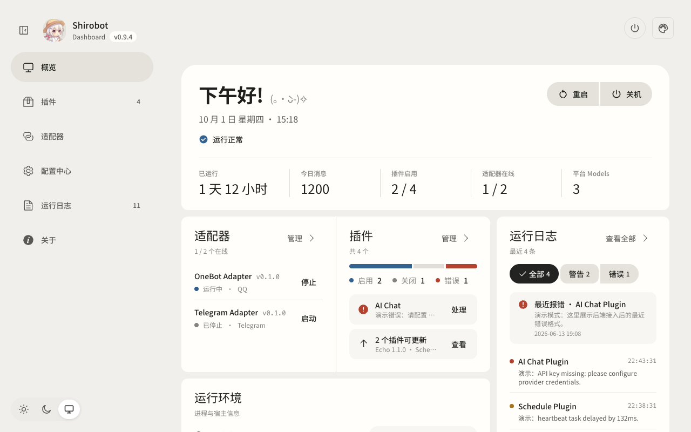

## 简介

用于 Shirobot 的 Web 控制台。

<p align="center">
  
</p>

## 开发

安装依赖：

```bash
npm ci
```

启动开发服务器：

```bash
npm run dev
```
构建：

```bash
npm run build
```

预览构建产物：

```bash
npm run preview
```

## API 约定

所有前端请求入口统一放在：

```text
src/api
```

API 模式使用以下 `/api/v1` 接口；演示模式也遵循相同响应结构。
## 许可证

本项目使用 GNU General Public License v3.0。
详见 [LICENSE](./LICENSE)。
